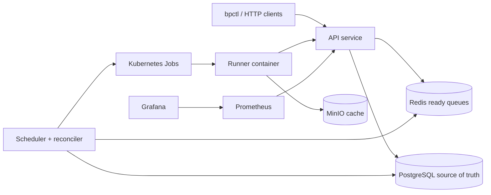

# BuildPlane

BuildPlane is a production-minded MVP for distributed CI workload orchestration. It accepts workflow runs through an HTTP API, persists durable state in PostgreSQL, uses Redis as a derived priority queue, schedules fairly across tenants, launches each attempt as a Kubernetes Job, and protects runner callbacks with short-lived leases.



## Quick Start

Prerequisites: Go, Docker, kubectl, kind, and curl.

```bash
make demo
```

The demo starts local infra, creates a kind cluster, builds and loads images, deploys BuildPlane, creates a workflow, submits a fixture repository run, verifies idempotency, waits for success, and prints logs.

Useful endpoints:

- API: `http://localhost:8080`
- Prometheus: `http://localhost:9090`
- Grafana: `http://localhost:3000`
- MinIO console: `http://localhost:9001`

## Commands

```bash
make bootstrap
make kind-up
make infra-up
make build
make images
make deploy
make migrate
make test
make demo
make dashboards
make logs
make clean
```

CLI examples:

```bash
go run ./cmd/bpctl workflow create -f examples/workflows/go-fixture.yaml
go run ./cmd/bpctl run create --workflow <workflow-id> --repo fixture://demo-repository --commit main --priority high
go run ./cmd/bpctl run get <run-id>
go run ./cmd/bpctl job logs <job-id>
go run ./cmd/bpctl run cancel <run-id>
```

HTTP run creation:

```bash
curl -X POST http://localhost:8080/v1/runs \
  -H 'Content-Type: application/json' \
  -H 'Idempotency-Key: client-key-1' \
  -d '{"workflow_id":"<workflow-id>","repository_url":"fixture://demo-repository","commit_sha":"main","priority":"high"}'
```

## Services

- `api`: validates requests, applies idempotency, persists runs/jobs, enqueues work, serves status/logs, accepts authenticated runner callbacks, and exposes metrics.
- `scheduler`: reads Redis candidates, enforces admission limits, uses priority plus tenant deficit round-robin, claims jobs atomically in PostgreSQL, creates Kubernetes Jobs, and reconciles queued/expired work.
- `runner`: clones public or fixture repositories, executes commands, uploads logs, renews leases, and reports final status.
- `autoscaler`: evaluates queue-driven capacity recommendations and emits metrics.
- `bpctl`: small API-backed CLI.

## Design Decisions

- PostgreSQL owns truth; Redis is rebuilt when it drifts.
- Delivery is at least once. Duplicate queue delivery is safe because job claims are conditional.
- Runner ownership is lease based. Only token hashes are stored, and stale completions are rejected.
- BuildPlane owns retries; Kubernetes Jobs use `backoffLimit: 0`.
- Scheduling distinguishes priority from tenant weight: priority decides service class, tenant weight decides fair share within that service class.
- Logs live in PostgreSQL for the MVP; production should chunk logs to object storage.

## Known Limitations

- Redis and PostgreSQL can temporarily disagree until reconciliation repairs Redis.
- At-least-once execution can duplicate user-side effects.
- Lease expiration can create overlapping attempts; stale-result protection preserves final state but cannot undo command side effects.
- Kubernetes Job startup latency is unsuitable for extremely short tasks.
- The local autoscaler exports a desired capacity target rather than provisioning cloud nodes.
- Fixture/public Git support is not enough for private enterprise repositories.
- Shared-cluster execution is not sufficient for hostile untrusted code.
- PostgreSQL polling will need partitioning or sharding for very large installations.
- Cache correctness depends on complete cache-key inputs.

## Interview Study

Start with:

- [Architecture](docs/architecture.md)
- [Scheduling](docs/scheduling.md)
- [Failure model](docs/failure-model.md)
- [Consistency](docs/consistency.md)
- [Caching](docs/caching.md)
- [Autoscaling](docs/autoscaling.md)
- [Interview guide](docs/interview-guide.md)
