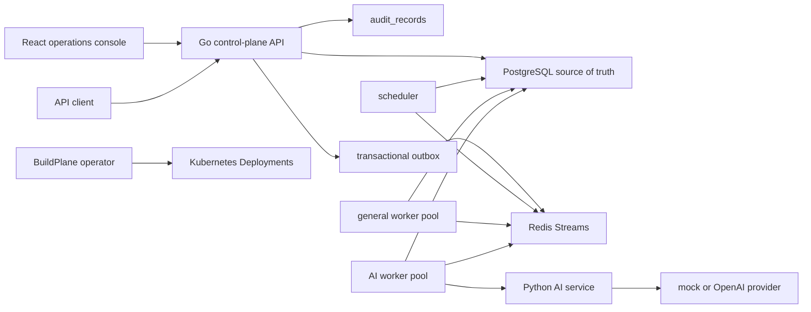

# BuildPlane

BuildPlane is a Kubernetes-native control plane for operating reusable
AI-assisted workflow components safely.

It is built for teams that want AI inside operational workflows without letting
model calls own durable state, approval boundaries, rollout decisions, or
external side effects.

## The Problem

Enterprise workflows often need AI for classification, extraction, triage, and
decision support. The hard part is not calling a model. The hard part is safely
operating the workflow around the model:

- retries after worker crashes
- idempotent API requests
- durable workflow and node state
- human approval checkpoints
- audit trails
- reusable component versioning
- evaluation before rollout
- canary, promotion, and rollback
- operational visibility across API, workers, queues, and AI services

BuildPlane treats those as control-plane problems.

## What BuildPlane Does

BuildPlane lets you run AI-assisted business workflows on a durable backend:

- Create workflow runs through a Go control-plane API.
- Persist workflow, node, component, decision, and audit state in PostgreSQL.
- Dispatch node execution through Redis Streams with PostgreSQL leases and
  fencing.
- Run deterministic and AI-backed workflow nodes in separate worker pools.
- Pause workflows for human approval and resume them through an idempotent API.
- Version reusable AI components and gate changes through synthetic evaluation,
  canary state, promotion, and rollback.
- Inspect and operate workflows through a React operations console.
- Package the platform for Kubernetes through Helm, with a GKE Terraform
  scaffold.

BuildPlane does not let an LLM mutate Kubernetes resources or external systems
directly. Models may interpret, classify, extract, and propose. Deterministic
application code validates, authorizes, persists, and executes.

## Current Maturity

BuildPlane is a serious learning project with production-shaped primitives, not
a production service you should run for real business traffic yet.

Implemented today:

- Go control-plane API
- PostgreSQL migrations and durable state
- Redis-backed scheduler and workers
- Python FastAPI AI service with deterministic mock provider
- OpenAI provider path behind explicit configuration
- Kubernetes manifests for local `kind`
- worker pools, ServiceAccounts, ConfigMaps, Secrets, probes, and resources
- narrow `BuildPlaneRuntime` CRD and operator
- Prometheus metrics, structured logs, and trace context propagation
- synthetic invoice and freight exception workflows
- human approval API and audit timeline
- component evaluation, canary, promotion, and rollback
- React and TypeScript operations console
- Helm chart and GKE Terraform scaffold
- CI checks for Go, Python, frontend, Helm, Terraform, and repository metadata

Not implemented yet:

- authentication and authorization
- tenant isolation
- production ingress, DNS, and TLS
- Cloud SQL or managed Redis provisioning
- secret-manager integration
- persistent observability storage and alert rules
- production autoscaling and queue backpressure controls
- durable workflow definition registry

## Architecture



Core rule: PostgreSQL is authoritative. Redis dispatches work, but Redis is not
the durable workflow state store.

## Repository Layout

```text
ai-service/                  Python FastAPI AI service
deploy/docker/               Dockerfiles and local Compose stack
deploy/grafana/              starter Grafana dashboard
deploy/helm/buildplane/      Helm chart for Kubernetes deployment
deploy/kind/                 local kind Kubernetes manifests
docs/                        architecture, ADRs, learning notes, runbooks
examples/                    synthetic workflow and component payloads
infra/gke/                   Terraform scaffold for GKE and Artifact Registry
migrations/                  PostgreSQL schema migrations
services/control-plane/      Go API, scheduler, workers, repositories
services/operator/           Go Kubernetes operator
web/                         React and TypeScript operations console
```

## Prerequisites

For local development:

- Go 1.26+
- Docker Desktop or compatible Docker daemon
- Node.js 22+
- Python 3.13+
- `curl`

For Kubernetes/cloud work:

- `kubectl`
- `kind`
- Helm
- Terraform
- `gcloud` for GKE

## Quickstart: Local End-to-End Demo

Create your private local environment file:

```bash
cp .env.example .env
```

The `.env` file is ignored by Git. Keep real API keys, database URLs, and
machine-specific settings there. The committed `.env.example` contains safe
synthetic defaults.

Start the backend stack:

```bash
docker compose --env-file .env -f deploy/docker/docker-compose.postgres.yaml up -d --build
```

Verify the API:

```bash
curl http://localhost:8080/readyz
curl http://localhost:8080/version
```

Start the web console:

```bash
cd web
npm install
npm run dev
```

Open the Vite URL, usually:

```text
http://localhost:5173
```

The web console proxies `/api` to `http://localhost:8080`.

Stop the local stack:

```bash
docker compose --env-file .env -f deploy/docker/docker-compose.postgres.yaml down
```

Remove local database data:

```bash
docker compose --env-file .env -f deploy/docker/docker-compose.postgres.yaml down -v
```

## End-to-End API Walkthrough

Create a synthetic invoice workflow run:

```bash
curl -i -X POST http://localhost:8080/v1/workflow-runs \
  -H 'Content-Type: application/json' \
  -H 'Idempotency-Key: invoice-demo-001' \
  --data @examples/demo-workflows/invoice-exception.json
```

List recent workflow runs:

```bash
curl -s 'http://localhost:8080/v1/workflow-runs?limit=10'
```

Inspect one workflow run:

```bash
curl -s http://localhost:8080/v1/workflow-runs/<workflow-run-id>
```

Inspect its audit trail:

```bash
curl -s http://localhost:8080/v1/workflow-runs/<workflow-run-id>/audit
```

Stream workflow snapshots with Server-Sent Events:

```bash
curl -N http://localhost:8080/v1/workflow-runs/<workflow-run-id>/events
```

When a demo run reaches `waiting_for_human`, approve it:

```bash
curl -i -X POST http://localhost:8080/v1/workflow-runs/<workflow-run-id>/decisions \
  -H 'Content-Type: application/json' \
  -H 'Idempotency-Key: invoice-demo-approval-001' \
  -d '{"decision":"approved","actor_id":"operator-1","reason":"Synthetic approval for local demo"}'
```

Rejecting instead cancels the workflow:

```bash
curl -i -X POST http://localhost:8080/v1/workflow-runs/<workflow-run-id>/decisions \
  -H 'Content-Type: application/json' \
  -H 'Idempotency-Key: invoice-demo-rejection-001' \
  -d '{"decision":"rejected","actor_id":"operator-1","reason":"Synthetic rejection for local demo"}'
```

## Component Release Walkthrough

BuildPlane includes a reusable `issue_classifier` component used by the local,
invoice, and freight workflows.

Create a candidate version:

```bash
curl -i -X POST http://localhost:8080/v1/component-versions \
  -H 'Content-Type: application/json' \
  --data @examples/component-versions/issue-classifier-v2.json
```

List component versions:

```bash
curl -s 'http://localhost:8080/v1/component-versions?component_name=issue_classifier&limit=10'
```

Check affected workflows:

```bash
curl -s http://localhost:8080/v1/components/issue_classifier/affected-workflows
```

Run evaluation:

```bash
curl -i -X POST http://localhost:8080/v1/component-versions/<component-version-id>/evaluations
```

Start canary:

```bash
curl -i -X POST http://localhost:8080/v1/component-versions/<component-version-id>/canary \
  -H 'Content-Type: application/json' \
  -d '{"percent":10}'
```

Promote:

```bash
curl -i -X POST http://localhost:8080/v1/component-versions/<component-version-id>/promote
```

Rollback:

```bash
curl -i -X POST http://localhost:8080/v1/components/issue_classifier/rollback \
  -H 'Content-Type: application/json' \
  -d '{"actor_id":"operator-1","reason":"Synthetic rollback exercise"}'
```

## Running Individual Services Locally

Load your local environment into the current shell:

```bash
set -a
source .env
set +a
```

Start PostgreSQL and Redis:

```bash
docker compose --env-file .env -f deploy/docker/docker-compose.postgres.yaml up -d postgres redis
```

Common environment:

```bash
echo "$BUILDPLANE_DATABASE_URL"
echo "$BUILDPLANE_REDIS_URL"
```

Run the API:

```bash
go run ./services/control-plane/cmd/buildplane-control-plane
```

Run the scheduler:

```bash
go run ./services/control-plane/cmd/buildplane-scheduler
```

Run a general worker:

```bash
BUILDPLANE_WORKER_POOL=general \
  go run ./services/control-plane/cmd/buildplane-worker
```

Run an AI worker:

```bash
BUILDPLANE_WORKER_POOL=ai \
BUILDPLANE_AI_SERVICE_URL='http://localhost:8090' \
  go run ./services/control-plane/cmd/buildplane-worker
```

Run the AI service with the deterministic mock provider:

```bash
python3 -m venv .cache/ai-service-venv
.cache/ai-service-venv/bin/pip install -e 'ai-service[dev]'
.cache/ai-service-venv/bin/python -m uvicorn app.main:app \
  --app-dir ai-service \
  --host 0.0.0.0 \
  --port 8090
```

## AI Provider Configuration

The AI service uses the deterministic mock provider by default.

To use the OpenAI provider:

```bash
export BUILDPLANE_AI_PROVIDER=openai
export OPENAI_API_KEY='<your-key>'
```

Do not commit real API keys, database URLs, or secret values.

## Kubernetes: Local kind

The recommended local Kubernetes path is Helm with the local kind values file.
This installs the full development stack inside Kubernetes, including a
single-replica PostgreSQL StatefulSet. Do not start Docker Compose Postgres and
do not create the database Secret manually for this path.

Build the local images:

```bash
docker build -f deploy/docker/control-plane.Dockerfile -t buildplane/control-plane:dev .
docker build -f deploy/docker/ai-service.Dockerfile -t buildplane/ai-service:dev .
docker build -f deploy/docker/operator.Dockerfile -t buildplane/operator:dev .
docker build -f deploy/docker/web.Dockerfile -t buildplane/web:dev .
```

Create the kind cluster if it does not already exist:

```bash
kind create cluster --config deploy/kind/cluster.yaml
kubectl config use-context kind-buildplane
```

Load the images into kind:

```bash
kind load docker-image buildplane/control-plane:dev --name buildplane
kind load docker-image buildplane/ai-service:dev --name buildplane
kind load docker-image buildplane/operator:dev --name buildplane
kind load docker-image buildplane/web:dev --name buildplane
```

Install BuildPlane:

```bash
helm lint deploy/helm/buildplane

helm upgrade --install buildplane deploy/helm/buildplane \
  --namespace buildplane-system \
  --create-namespace \
  --values deploy/helm/buildplane/values-kind.yaml \
  --wait \
  --timeout 10m
```

If you previously installed raw manifests or manually created resources, reset
the local namespace once before reinstalling with Helm:

```bash
kubectl delete namespace buildplane-system
kubectl wait --for=delete namespace/buildplane-system --timeout=120s

helm upgrade --install buildplane deploy/helm/buildplane \
  --namespace buildplane-system \
  --create-namespace \
  --values deploy/helm/buildplane/values-kind.yaml \
  --wait \
  --timeout 10m
```

Verify the rollout:

```bash
kubectl get pods -n buildplane-system
kubectl get statefulset buildplane-postgres -n buildplane-system
kubectl get secret buildplane-postgres -n buildplane-system
kubectl get buildplaneruntime -n buildplane-system
```

Open the API locally:

```bash
kubectl port-forward -n buildplane-system service/buildplane-control-plane 8080:80
curl http://localhost:8080/readyz
curl http://localhost:8080/version
```

Common checks:

```bash
kubectl logs -n buildplane-system deployment/buildplane-control-plane
kubectl logs -n buildplane-system deployment/buildplane-scheduler
kubectl describe pod -n buildplane-system <pod-name>
```

Detailed local Kubernetes instructions:

- [Local kind deployment guide](docs/deployment/local-kind.md)

## Kubernetes: Helm

For production-like environments, keep PostgreSQL outside this chart and create
the database Secret before installing BuildPlane:

```bash
helm lint deploy/helm/buildplane
helm template buildplane deploy/helm/buildplane \
  --namespace buildplane-system \
  --include-crds \
  --values deploy/helm/buildplane/values-gke.example.yaml
```

The default chart expects an externally managed `buildplane-postgres` Secret.
Helm references this Secret from the control plane, scheduler, general worker,
and AI worker, but it does not create or overwrite the Secret unless
`database.createSecret=true` is explicitly set.

```bash
kubectl create namespace buildplane-system
kubectl create secret generic buildplane-postgres \
  --namespace buildplane-system \
  --from-literal=database-url="$BUILDPLANE_DATABASE_URL"
```

Install or upgrade:

```bash
helm upgrade --install buildplane deploy/helm/buildplane \
  --namespace buildplane-system \
  --create-namespace \
  --values deploy/helm/buildplane/values-gke.example.yaml \
  --wait \
  --timeout 10m
```

## Cloud: GKE

Terraform scaffold:

```bash
cd infra/gke
cp terraform.tfvars.example terraform.tfvars
terraform init
terraform plan
```

The GKE deployment guide covers image tagging, Artifact Registry, Helm install,
and first rollout checks:

- [GKE deployment guide](docs/deployment/gke.md)
- [Cloud operations runbook](docs/runbooks/cloud-operations.md)

The current Terraform scaffold does not provision Cloud SQL, managed Redis, DNS,
TLS, or secret-manager integrations yet.

## Observability

Local endpoints:

```bash
curl http://localhost:8080/metrics
curl http://localhost:8090/metrics
```

In Kubernetes:

```bash
kubectl port-forward -n buildplane-system service/buildplane-prometheus 9090:9090
kubectl port-forward -n buildplane-system service/buildplane-grafana 3000:3000
```

Starter Grafana dashboard:

```text
deploy/grafana/buildplane-overview.json
```

## Testing

Run Go tests:

```bash
go test ./services/control-plane/...
go test ./services/operator/...
```

Run Python tests:

```bash
python3 -m venv .cache/ai-service-venv
.cache/ai-service-venv/bin/pip install -e 'ai-service[dev]'
.cache/ai-service-venv/bin/python -m pytest ai-service/tests
```

Run frontend checks:

```bash
cd web
npm ci
npm run typecheck
npm test
npm run build
```

Validate deployment packaging:

```bash
helm lint deploy/helm/buildplane
helm template buildplane deploy/helm/buildplane --namespace buildplane-system --include-crds
terraform -chdir=infra/gke fmt -check
terraform -chdir=infra/gke init -backend=false
terraform -chdir=infra/gke validate
```

## CI

GitHub Actions runs on pull requests to `main` and pushes to `main`.

CI currently checks:

- Go formatting, tests, and binary builds
- Python AI service tests
- frontend install, typecheck, tests, and build
- Helm lint and render
- Terraform formatting, init, and validation
- Kubernetes manifest YAML parsing
- JSON examples and dashboard parsing
- whitespace errors

## Documentation

Start here for deeper context:

- [Current build status](docs/BUILD_STATUS.md)
- [Build roadmap](docs/BUILD_ROADMAP.md)
- [Architecture overview](docs/architecture/overview.md)
- [Architecture decisions](docs/adr)
- [Learning notes](docs/learning)
- [GKE deployment guide](docs/deployment/gke.md)
- [Cloud operations runbook](docs/runbooks/cloud-operations.md)

## Design Principles

- PostgreSQL is the durable source of truth.
- Redis is dispatch, not authority.
- All meaningful state transitions are auditable.
- Workflow creation, human decisions, and completion paths are idempotent.
- Worker completion uses leases and fencing to protect against stale workers.
- AI output is validated by deterministic code before it affects workflow state.
- External effects remain guarded and synthetic at this stage.
- Kubernetes API permissions are least-privilege by default.

## License

License is not defined yet.
