# BuildPlane Architecture Overview

BuildPlane is a Kubernetes-native control plane for reusable AI workflow
components. It will be built incrementally, starting with a tiny Kubernetes
workload and growing toward a durable workflow execution platform.

## Product Boundary

BuildPlane manages:

- Versioned workflow components
- Workflow runs and node execution state
- Worker dispatch and leases
- Human approval checkpoints
- AI extraction and classification calls through a bounded service
- Guarded external tool calls
- Evaluation, canary, promotion, and rollback of reusable components
- Audit records for every meaningful state transition

BuildPlane does not allow an LLM to mutate external systems or Kubernetes
resources directly.

## Initial System Shape

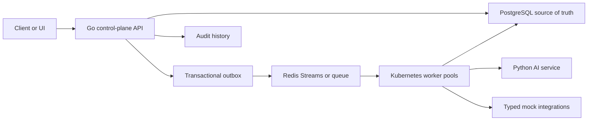

## Future Kubernetes Shape

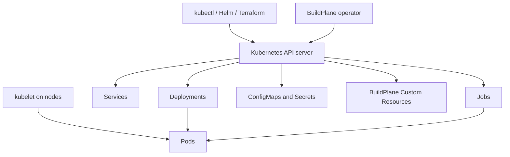

## Durable State Principles

- PostgreSQL stores workflow runs, node runs, component versions, audit records,
  leases, idempotency records, and outbox events.
- Redis may dispatch work, but Redis is not the only durable record of work.
- Workers are assumed to crash at any point.
- Completion must be idempotent.
- At-least-once delivery is expected.
- Stale workers must be fenced from overwriting newer attempts.

## Kubernetes Learning Path

BuildPlane will learn Kubernetes in this order:

1. Container image
2. Pod
3. Deployment and ReplicaSet
4. Service
5. Probes
6. ConfigMap and Secret
7. Job
8. ServiceAccount and RBAC
9. Resource requests and limits
10. Graceful shutdown
11. Autoscaling
12. CRD and operator
13. Helm packaging
14. GKE deployment

This order is deliberate. Operators make more sense after the lower-level
objects are familiar.

## Current Phase 1 Runtime

Phase 1 introduces one running service:

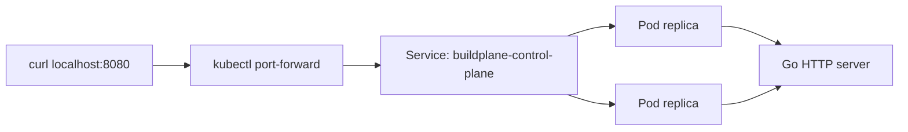

The service is intentionally small. It proves the path from Go source code to
container image to Kubernetes Deployment and Service before adding PostgreSQL,
Redis, CRDs, or workers.

## Current Phase 2 Runtime

Phase 2 makes workflow creation durable:

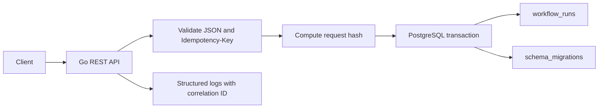

The only workflow state transition implemented so far is:

```text
created request -> queued workflow_run
```

Redis, workers, node state machines, and outbox publication begin in later
phases.

## Current Phase 3 Runtime

Phase 3 introduces the first scheduler and worker loop:

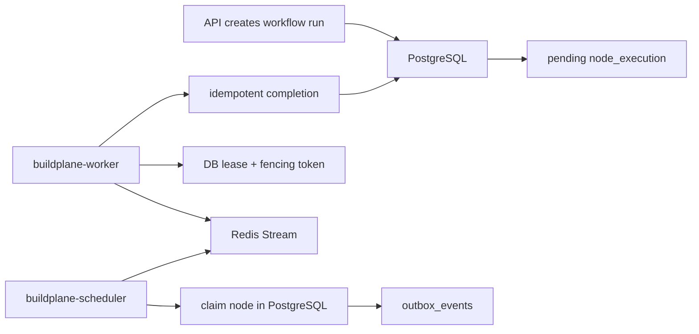

Redis is not authoritative. A Redis message tells a worker what to try; the
PostgreSQL lease decides whether the worker is allowed to run or complete the
task.

## Current Phase 4 Runtime

Phase 4 adds a local deterministic workflow:

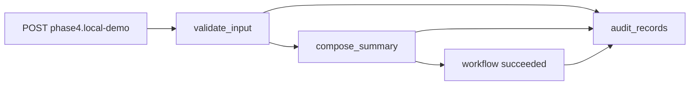

Node ordering is application-defined in Go code for now. Completion of one node
creates the next pending node inside the same PostgreSQL transaction. If a node
fails, retry behavior is bounded by that node's `MaxAttempts`.

## Current Phase 5 Runtime

Phase 5 adds a Python AI service behind a Kubernetes Service:

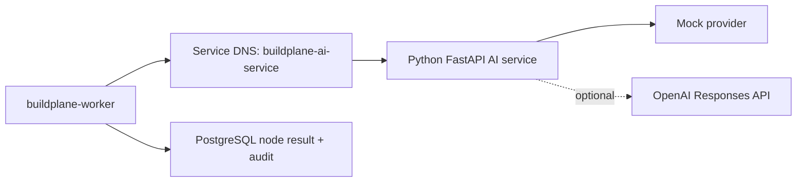

The worker calls `classify_issue` through a typed HTTP client. The AI service is
mock-backed by default, and the OpenAI provider is enabled only through
environment configuration and credentials.

## Current Phase 6 Runtime

Phase 6 splits worker execution into Kubernetes worker pools:

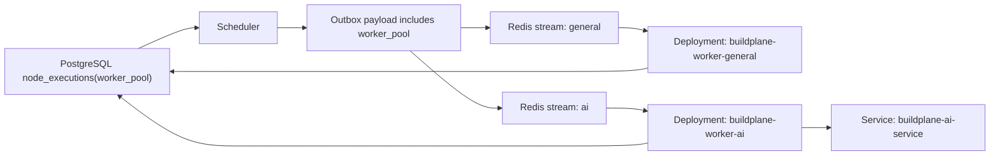

The durable state model is unchanged. Worker pools decide which Pods should see
which queue messages; PostgreSQL leases and fencing still decide which worker is
allowed to execute and complete a node.

## Current Phase 7 Runtime

Phase 7 adds a narrow Kubernetes operator:

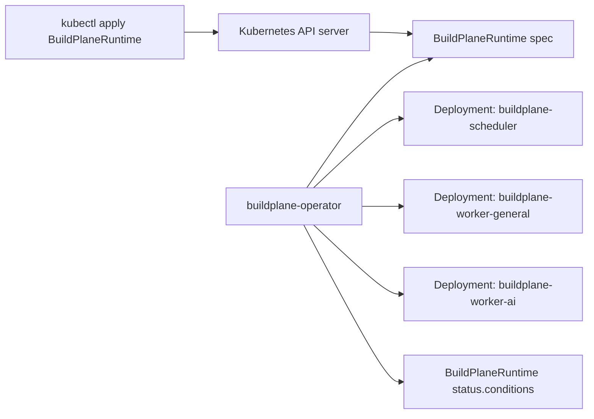

The operator reconciles only scheduler and worker pool replica counts. It does
not manage workflow execution state, Redis messages, PostgreSQL rows, Secrets,
or AI provider behavior.

## Current Phase 8 Runtime

Phase 8 adds the first observability layer:

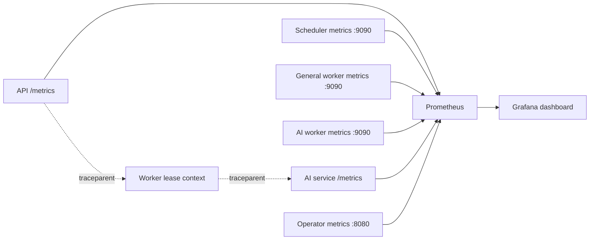

Metrics are intentionally bounded by labels like service, status, workflow name,
worker pool, node name, provider, and result. Workflow run IDs stay in audit
records and logs rather than metric labels.

## Current Phase 9 Runtime

Phase 9 adds synthetic demo workflows with a human approval checkpoint:

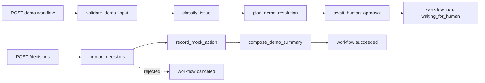

The approval boundary is durable. A worker can pause the run, but only the API
decision endpoint can resume it. Approved decisions create the guarded mock
action node; rejected decisions cancel the workflow. No real external system is
called in this phase.

## Current Phase 10 Runtime

Phase 10 adds release gates for reusable AI components:

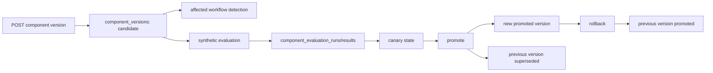

The canary percentage is durable desired release state. It does not yet route
live workflow traffic. The important behavior in this phase is the gate:
evaluation must pass before canary, and canary must exist before promotion.
