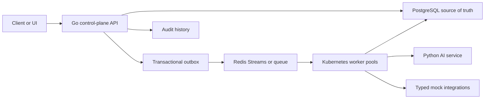
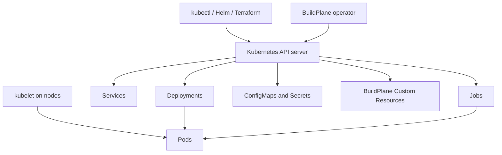
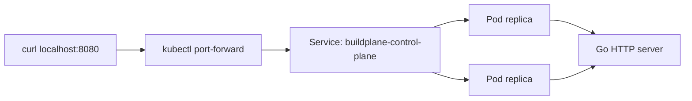
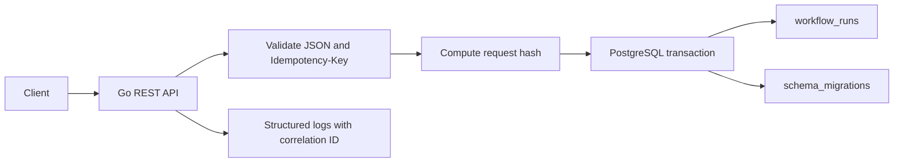

# BuildPlane Architecture Overview

BuildPlane is a Kubernetes-native control plane for reusable AI workflow
components. It will be built incrementally, starting with a tiny Kubernetes
workload and growing toward a durable workflow execution platform.

## Product Boundary

BuildPlane manages:

- Versioned workflow components
- Workflow runs and node execution state
- Worker dispatch and leases
- Human approval checkpoints
- AI extraction and classification calls through a bounded service
- Guarded external tool calls
- Evaluation, canary, promotion, and rollback of reusable components
- Audit records for every meaningful state transition

BuildPlane does not allow an LLM to mutate external systems or Kubernetes
resources directly.

## Initial System Shape



## Future Kubernetes Shape



## Durable State Principles

- PostgreSQL stores workflow runs, node runs, component versions, audit records,
  leases, idempotency records, and outbox events.
- Redis may dispatch work, but Redis is not the only durable record of work.
- Workers are assumed to crash at any point.
- Completion must be idempotent.
- At-least-once delivery is expected.
- Stale workers must be fenced from overwriting newer attempts.

## Kubernetes Learning Path

BuildPlane will learn Kubernetes in this order:

1. Container image
2. Pod
3. Deployment and ReplicaSet
4. Service
5. Probes
6. ConfigMap and Secret
7. Job
8. ServiceAccount and RBAC
9. Resource requests and limits
10. Graceful shutdown
11. Autoscaling
12. CRD and operator
13. Helm packaging
14. GKE deployment

This order is deliberate. Operators make more sense after the lower-level
objects are familiar.

## Current Phase 1 Runtime

Phase 1 introduces one running service:



The service is intentionally small. It proves the path from Go source code to
container image to Kubernetes Deployment and Service before adding PostgreSQL,
Redis, CRDs, or workers.

## Current Phase 2 Runtime

Phase 2 makes workflow creation durable:



The only workflow state transition implemented so far is:

```text
created request -> queued workflow_run
```

Redis, workers, node state machines, and outbox publication begin in later
phases.
