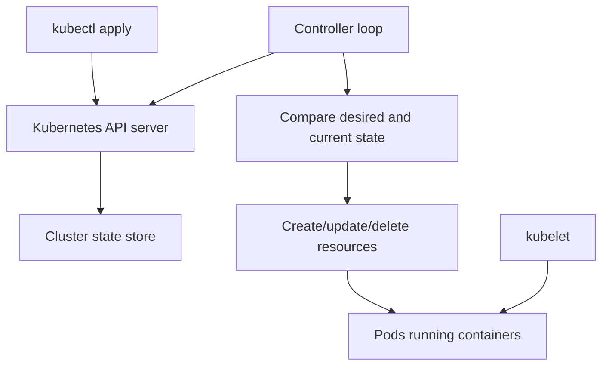

# Phase 00: Kubernetes Control Plane Mental Model

## Concepts Learned

### Kubernetes API Server

The API server is the front door to Kubernetes. When you run `kubectl apply`,
you are sending an object to the API server. The API server validates and stores
that object. Other Kubernetes components then react to it.

In BuildPlane, this matters because our future operator will use the same API
server pattern: watch desired state, compare reality, and reconcile.

### Desired State

Kubernetes is built around desired state. You declare what should be true, such
as "run three replicas of this container." Kubernetes controllers continuously
work to make the real cluster match that declaration.

This is different from a shell script. A script says "do these steps."
Kubernetes says "keep this condition true."

### Controllers

A controller is a loop:

1. Watch the API.
2. Read desired state.
3. Read current state.
4. Take action to reduce the difference.
5. Record status.

Deployments, ReplicaSets, Jobs, and future BuildPlane operators all follow this
pattern.

### Pods

A Pod is the smallest schedulable unit in Kubernetes. It usually contains one
application container. Pods are disposable. You normally create Deployments,
Jobs, or other owners that create Pods for you.

### Operators and Custom Resources

A Custom Resource Definition, or CRD, adds a new object type to Kubernetes. An
operator is a controller that watches those custom objects and manages other
resources or external systems.

BuildPlane will eventually use an operator, but not immediately. First we will
learn plain Kubernetes objects.

## Architecture Diagram



## Important Code Paths

No application code exists yet.

Important documentation paths:

- `AGENTS.md`
- `docs/BUILD_ROADMAP.md`
- `docs/BUILD_STATUS.md`
- `docs/architecture/overview.md`
- `docs/adr/0001-pivot-to-kubernetes-native-ai-control-plane.md`

## Commands

These commands will become useful in Phase 1 after a local `kind` cluster
exists:

```bash
kubectl cluster-info
kubectl get nodes
kubectl get pods --all-namespaces
kubectl get events --sort-by=.lastTimestamp
kubectl describe pod <pod-name>
kubectl logs <pod-name>
kubectl rollout status deployment/<deployment-name>
```

Useful local tool checks:

```bash
docker version
kind version
kubectl version --client
go version
```

## Debugging Exercises

1. Find out whether `kubectl` is installed.
2. Find out whether Docker is running.
3. Create a local `kind` cluster.
4. Run `kubectl get nodes` and identify the node name.
5. Delete the cluster and recreate it.

Do not worry if these commands are not comfortable yet. Phase 1 will walk
through them slowly.

## Tradeoffs

Starting with documentation feels slower than writing YAML immediately, but it
creates a map. Kubernetes projects become confusing when the learner cannot
explain which controller owns which object or where state actually lives.

Deferring CRDs and operators also keeps the first implementation honest. A
BuildPlane operator will be easier to understand after Deployments, Services,
Jobs, probes, and RBAC are familiar.

## Five Interview Questions

1. What happens after you run `kubectl apply -f deployment.yaml`?
2. Why are Pods considered disposable?
3. What is the difference between desired state and current state?
4. What does a Kubernetes controller do?
5. Why should BuildPlane wait before introducing CRDs?

## Five Short Answers

1. The object is sent to the API server, validated, stored, and reconciled by
   controllers.
2. Pods can be killed, rescheduled, or replaced; higher-level controllers own
   their lifecycle.
3. Desired state is what the API object says should exist; current state is what
   is actually happening in the cluster.
4. A controller watches state and takes action to make current state match
   desired state.
5. CRDs are easier to design after the team understands the built-in objects and
   has proven the behavior with simpler primitives.

## Teach It Back Exercise

Explain Kubernetes in your own words using these five terms:

- API server
- Desired state
- Controller
- Pod
- Deployment

Keep it under two minutes. If you cannot explain one term, that is the next
thing to inspect with `kubectl` during Phase 1.
