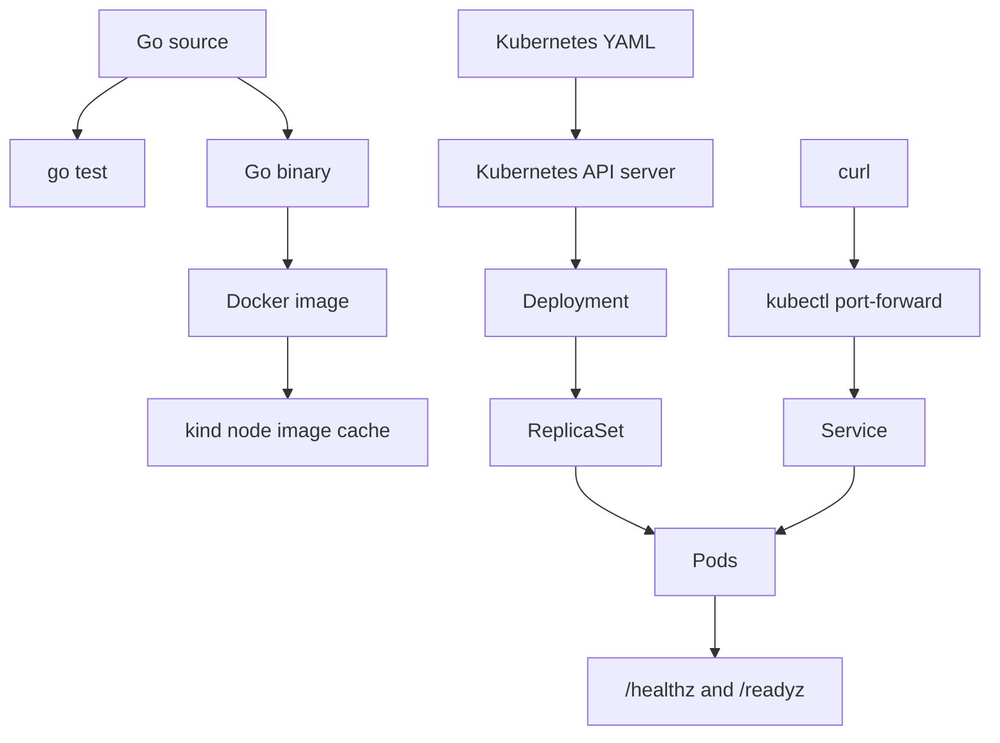

# Phase 01: First Kubernetes Workload

## Concepts Learned

### Container

A container is a packaged process. It includes the executable, filesystem
contents, environment, exposed ports, and startup command needed to run the
process consistently.

It exists because Kubernetes needs a repeatable artifact to run on different
nodes. In BuildPlane, the first container image packages the Go control-plane
HTTP service.

How it works:

1. Docker reads `deploy/docker/control-plane.Dockerfile`.
2. The build stage compiles the Go binary.
3. The runtime stage copies only the binary and CA certificates.
4. Kubernetes later starts that image inside Pods.

Common mistake: treating a container like a full virtual machine. A container is
just a process with isolation.

Inspect or debug it:

```bash
docker build -f deploy/docker/control-plane.Dockerfile -t buildplane/control-plane:dev .
docker run --rm -p 8080:8080 buildplane/control-plane:dev
curl http://localhost:8080/version
```

### Pod

A Pod is the smallest thing Kubernetes schedules. It wraps one or more
containers with shared networking, storage, and lifecycle.

It exists because Kubernetes schedules and supervises Pods, not raw containers.
In BuildPlane, the Deployment creates Pods that run the control-plane container.

Common mistake: depending on one Pod name. Pods are disposable and can be
replaced at any time.

Inspect or debug it:

```bash
kubectl get pods -n buildplane-system -o wide
kubectl describe pod -n buildplane-system <pod-name>
kubectl logs -n buildplane-system <pod-name>
```

### Deployment

A Deployment declares how many replicated Pods should exist and how they should
roll out.

It exists so Kubernetes can replace failed Pods and manage updates. In
BuildPlane, `deploy/kind/buildplane-control-plane.yaml` declares two replicas of
the control-plane service.

How it works:

```text
Deployment -> ReplicaSet -> Pods -> Containers
```

Common mistake: debugging only the Pod and missing the Deployment and ReplicaSet
that own it.

Inspect or debug it:

```bash
kubectl get deployment -n buildplane-system
kubectl describe deployment buildplane-control-plane -n buildplane-system
kubectl rollout status deployment/buildplane-control-plane -n buildplane-system
```

### Service

A Service gives a stable network name and virtual IP for a changing set of Pods.

It exists because Pod IPs are temporary. In BuildPlane, the Service selects Pods
with the label `app.kubernetes.io/name: buildplane-control-plane` and forwards
port 80 to the Pods' named `http` port.

Common mistake: mismatching the Service selector and Pod labels. The Service
exists, but it has no endpoints.

Inspect or debug it:

```bash
kubectl get service -n buildplane-system
kubectl get endpoints -n buildplane-system
kubectl describe service buildplane-control-plane -n buildplane-system
```

### Readiness and Liveness Probes

Probes are health checks run by kubelet.

Readiness answers "should this Pod receive traffic?" Liveness answers "should
this container be restarted?" In BuildPlane, readiness uses `/readyz` and
liveness uses `/healthz`.

Common mistake: using liveness for dependency readiness. A temporary database
outage should usually remove traffic through readiness, not restart the process.

Inspect or debug it:

```bash
kubectl describe pod -n buildplane-system <pod-name>
kubectl get events -n buildplane-system --sort-by=.lastTimestamp
```

## Architecture Diagram



## Important Code Paths

- `services/control-plane/cmd/buildplane-control-plane/main.go`
  - Starts the HTTP server.
  - Reads `PORT`, defaulting to `8080`.
  - Handles `SIGINT` and `SIGTERM`.
  - Shuts down gracefully with a 10 second timeout.

- `services/control-plane/internal/httpapi/server.go`
  - Defines `/healthz`, `/readyz`, and `/version`.
  - Restricts endpoints to `GET`.
  - Returns JSON responses.

- `services/control-plane/internal/httpapi/server_test.go`
  - Verifies the health, readiness, version, and method behavior.

- `deploy/docker/control-plane.Dockerfile`
  - Builds a static Linux binary.
  - Runs it from a minimal `scratch` image as a non-root user.

- `deploy/kind/buildplane-control-plane.yaml`
  - Defines the Namespace, Deployment, and Service.
  - Adds probes, resource requests and limits, and container security settings.

## Commands

Check local tools:

```bash
go version
docker version
kind version
kubectl version --client
```

Run tests:

```bash
go test ./services/control-plane/...
```

Run the service directly:

```bash
go run ./services/control-plane/cmd/buildplane-control-plane
curl http://localhost:8080/healthz
curl http://localhost:8080/readyz
curl http://localhost:8080/version
```

Build the image:

```bash
docker build -f deploy/docker/control-plane.Dockerfile -t buildplane/control-plane:dev .
```

Create the local cluster:

```bash
kind create cluster --config deploy/kind/cluster.yaml
```

Load the image into `kind`:

```bash
kind load docker-image buildplane/control-plane:dev --name buildplane
```

Apply the Kubernetes manifests:

```bash
kubectl apply -f deploy/kind/buildplane-control-plane.yaml
```

Watch rollout:

```bash
kubectl rollout status deployment/buildplane-control-plane -n buildplane-system
```

Inspect state:

```bash
kubectl get all -n buildplane-system
kubectl get pods -n buildplane-system -o wide
kubectl get endpoints -n buildplane-system
kubectl get events -n buildplane-system --sort-by=.lastTimestamp
```

Call the service through a port-forward:

```bash
kubectl port-forward -n buildplane-system service/buildplane-control-plane 8080:80
curl http://localhost:8080/version
```

## Debugging Exercises

### Break: image not available

Create the cluster and apply the manifest before loading the image:

```bash
kind create cluster --config deploy/kind/cluster.yaml
kubectl apply -f deploy/kind/buildplane-control-plane.yaml
kubectl get pods -n buildplane-system
kubectl describe pod -n buildplane-system <pod-name>
```

Expected failure: the Pods may show `ImagePullBackOff` because the local image is
not available inside the `kind` node.

Recover:

```bash
docker build -f deploy/docker/control-plane.Dockerfile -t buildplane/control-plane:dev .
kind load docker-image buildplane/control-plane:dev --name buildplane
kubectl rollout restart deployment/buildplane-control-plane -n buildplane-system
kubectl rollout status deployment/buildplane-control-plane -n buildplane-system
```

### Break: Service selector mismatch

Temporarily edit the Service selector label to a value that does not match the
Pod template label, then apply it:

```bash
kubectl apply -f deploy/kind/buildplane-control-plane.yaml
kubectl get endpoints -n buildplane-system
```

Expected failure: the Service has no ready endpoints.

Recover: restore the selector to
`app.kubernetes.io/name: buildplane-control-plane` and reapply the manifest.

### Break: readiness path

Temporarily change the readiness probe path from `/readyz` to `/missing`, then
apply it:

```bash
kubectl apply -f deploy/kind/buildplane-control-plane.yaml
kubectl describe pod -n buildplane-system <pod-name>
kubectl get endpoints -n buildplane-system
```

Expected failure: Pods run, but they are not ready and the Service should not
send them traffic.

Recover: restore `/readyz` and reapply the manifest.

## Tradeoffs

The service uses Go's standard library instead of a framework. That keeps Phase
1 focused on the Kubernetes lifecycle, not router abstractions.

The Docker image uses a minimal `scratch` runtime and a non-root user. That is
slightly less convenient for shell debugging because there is no shell inside
the container, but it teaches a production-friendly default.

The Kubernetes manifest is plain YAML instead of Helm. Helm comes later after
the base objects are familiar.

## Five Interview Questions

1. What creates Pods for a Deployment?
2. Why does a Service use labels?
3. What is the difference between readiness and liveness?
4. Why do local Docker images need to be loaded into `kind`?
5. What does `kubectl rollout status` tell you?

## Five Short Answers

1. The Deployment creates a ReplicaSet, and the ReplicaSet creates Pods.
2. Labels let the Service select a changing set of matching Pods.
3. Readiness controls traffic; liveness controls restarts.
4. A `kind` node runs inside Docker and has its own image cache.
5. It reports whether the Deployment's desired Pods have rolled out
   successfully.

## Teach It Back Exercise

Explain this chain in your own words:

```text
Dockerfile -> image -> kind load -> Deployment -> ReplicaSet -> Pod -> Service
```

Then answer: if `curl` fails, which three Kubernetes commands would you run
first, and why?
